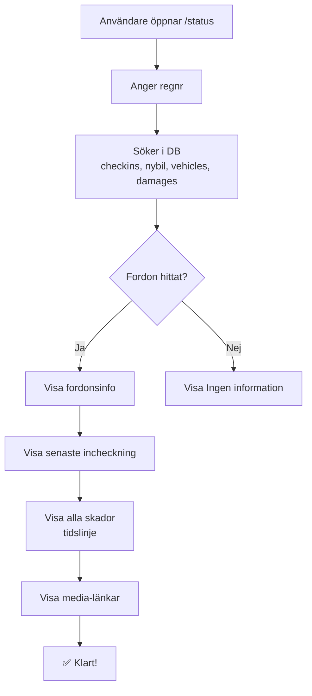

# MABI Syd Incheckningssystem - Översikt

**Version:** 3.0 (januari 2026)  
**Ägare:** Per Andersson (per@incheckad.se)  
**Tech Stack:** Next.js 14, TypeScript, Supabase (PostgreSQL), Resend (Email), Vercel (Hosting)

---

## 📋 Innehåll

1. [Systemöversikt](#systemöversikt)
2. [Huvudfunktioner](#huvudfunktioner)
3. [Användarflöden](#användarflöden)
4. [Dataflöde & Integration](#dataflöde--integration)
5. [Teknisk Arkitektur](#teknisk-arkitektur)
6. [Deployment & Miljöer](#deployment--miljöer)
7. [Viktiga Koncept](#viktiga-koncept)
8. [Dokumentation](#dokumentation)
9. [Vanliga Uppgifter](#vanliga-uppgifter)

---

## Systemöversikt

MABI Syd Incheckningssystem är ett internt verktyg för att hantera: 

- ✅ **Incheckning av fordon** vid återlämnande från uthyrning
- ✅ **Nybilsinventering** vid mottagande av nya fordon
- ✅ **Skadehantering** (dokumentera nya skador + hantera befintliga BUHS-skador)
- ✅ **Fordonsstatussökning** (var är bilen?  senaste incheckning?  skador?)
- ✅ **Email-notifieringar** till huvudstation och bilkontroll

---

## Huvudfunktioner

### 1. `/check` - Incheckning av fordon

**Syfte:** Dokumentera fordons tillstånd vid återlämnande från kund. 

**Användare:** Stationspersonal (Helsingborg, Malmö, Varberg, etc.)

**Funktioner:**
- 📝 Registrera regnr, mätarställning, laddnivå/tankstatus
- 📸 Dokumentera nya skador med foto/video + positionsmarkörer
- ✅ Hantera befintliga BUHS-skador (dokumentera, bekräfta, "kunde ej hitta")
- 📊 Fakta-ruta:  visa bilinfo från Bilkontroll + BUHS-skador
- 📧 Skicka email till huvudstation + bilkontroll

**Output:**
- Rader i:  `checkins`, `checkin_damages`, `damages`
- Email via Resend till 2 mottagargrupper

---

### 2. `/nybil` - Nybilsinventering

**Syfte:** Registrera nya fordon vid leverans till MABI. 

**Användare:** Bilkontrollpersonal (Latif, Per)

**Funktioner:**
- 📝 Fullständig inventering (utrustning, nycklar, laddkablar, etc.)
- 📸 Dokumentera skador vid leverans
- 📦 Registrera förvaring (hjul, extranycklar, COC, etc.)
- 🚗 Ange saluinfo (planerad station, saludatum, köpare)
- 📧 Skicka email till huvudstation + bilkontroll

**Output:**
- Rad i: `nybil_inventering`
- Rader i: `damages` (om skador vid leverans)
- Email via Resend

---

### 3. `/status` - Fordonsstatussökning

**Syfte:** Hitta information om ett fordon (var är det?  senaste incheckning? skador? ).

**Användare:** Alla (stationspersonal, bilkontroll, kundtjänst)

**Funktioner:**
- 🔍 Sök på regnr (fuzzy matching)
- 📊 Visa senaste incheckning (plats, datum, incheckare)
- 🚗 Visa bilinfo (märke, modell, hjulförvaring)
- 📜 Visa alla skador (nya + BUHS) med tidslinjevy
- 📸 Visa media för varje skada
- ⚠️ Visa varningar (saludatum, rekond, ej uthyrningsbar)

**Output:**
- Ingen databas-write (read-only)

---

### 4. CSV-import (manuell)

**Syfte:** Importera externa data från BUHS-system + Bilkontroll-Excel.

**Användare:** Per (endast)

**Funktioner:**
- 📂 **Skadefilen (BUHS):** Import av skador från Excel → `damages` + `damages_external`
- 📂 **Bilkontrollfilen:** Import av bilinfo från Excel → `vehicles`

**Output:**
- Rader i: `damages`, `damages_external`, `vehicles`

**Dokumentation:** [CSV-import. md](./docs/wiki/CSV-import.md)

---

## Användarflöden

### Flöde 1: Incheckning av fordon (normal)

```mermaid
graph TD
    A[Stationspersonal öppnar /check] --> B[Anger regnr]
    B --> C[Fakta-ruta laddas<br/>Bilinfo + BUHS-skador]
    C --> D{Nya skador?}
    D -->|Ja| E[Foto + positionsmarkering]
    D -->|Nej| F[Klicka Inga nya skador]
    E --> G[Hantera BUHS-skador]
    F --> G
    G --> H[Fyll i mätarställning, laddning, plats]
    H --> I[Skicka formulär]
    I --> J[/api/notify]
    J --> K[(Supabase DB)]
    J --> L[📧 Email till huvudstation]
    J --> M[📧 Email till bilkontroll]
    K --> N[✅ Klart! ]
    L --> N
    M --> N
```

---

### Flöde 2: Nybilsinventering

```mermaid
graph TD
    A[Bilkontroll öppnar /nybil] --> B[Anger regnr + grundinfo]
    B --> C[Fyller i utrustning<br/>nycklar, laddkablar, etc.]
    C --> D{Skador vid leverans?}
    D -->|Ja| E[Foto + positionsmarkering]
    D -->|Nej| F[Fortsätt]
    E --> F
    F --> G[Fyll i saluinfo]
    G --> H[Skicka formulär]
    H --> I[/api/notify-nybil]
    I --> J[(Supabase DB)]
    I --> K[📧 Email till huvudstation]
    I --> L[📧 Email till bilkontroll]
    J --> M[✅ Klart!]
    K --> M
    L --> M
```

---

### Flöde 3: Statussökning



---

## Dataflöde & Integration

### Datakällor

```
┌──────────────���──────────────────────────────────────────────┐
│                      EXTERNA KÄLLOR                          │
├─────────────────────────────────────────────────────────────┤
│                                                              │
│  📧 BUHS Skadefil (Excel)                                    │
│  └─> Mejlas till per. andersson@mabi.se varje vardag kl 8    │
│  └─> Manuell import → damages + damages_external            │
│                                                              │
│  📊 Bilkontrollfilen (Excel)                                 │
│  └─> MABISYD Bilkontroll 2024-2025. xlsx (OneDrive)          │
│  └─> Manuell import → vehicles                              │
│                                                              │
│  🔌 BUHS API (automatisk vid /check)                         │
│  └─> Hämtar skador via RPC get_damages_by_trimmed_regnr     │
│  └─> Källa: damages_external                                │
│                                                              │
│  🚗 Vehicle API (planerad, ej implementerad)                 │
│  └─> Hämta bilinfo från Transportstyrelsen                  │
│                                                              │
└─────────────────────────────────────────────────────────────┘

                            ↓

┌─────────────────────────────────────────────────────────────┐
│                    SUPABASE DATABASE                         │
├─────────────────────────────────────────────────────────────┤
│                                                              │
│  📦 checkins              (incheckningar)                    │
│  📦 checkin_damages       (skador vid incheckning)           │
│  📦 damages               (konsoliderad skadehistorik)       │
│  📦 damages_external      (BUHS-skador, RPC-källa)           │
│  📦 nybil_inventering     (nybilsregistreringar)             │
│  📦 vehicles              (fordonsmaster från Bilkontroll)   │
│                                                              │
└─────────────────────────────────────────────────────────────┘

                            ↓

┌─────────────────────────────────────────────────────────────┐
│                    FRONTEND (Next.js)                        │
├─────────────────────────────────────────────────────────────┤
│                                                              │
│  🌐 /check                (incheckning)                      │
│  🌐 /nybil                (nybilsinventering)                │
│  🌐 /status               (statussökning)                    │
│                                                              │
└─────────────────────────────────────────────────────────────┘

                            ↓

┌─────────────────────────────────────────────────────────────┐
│                    API ROUTES (Next.js)                      │
├─────────────────────────────────────────────────────────────┤
│                                                              │
│  📬 /api/notify           (email vid incheckning)            │
│  📬 /api/notify-nybil     (email vid nybilsinventering)      │
│                                                              │
└─────────────────────────────────────────────────────────────┘

                            ↓

┌─────────────────────────────────────────────────────────────┐
│                    RESEND (Email Service)                    │
├─────────────────────────────────────────────────────────────┤
│                                                              │
│  📧 Huvudstation-email    (helsingborg@incheckad.se etc.)    │
│  📧 Bilkontroll-email     (latif@incheckad.se, per@...)      │
│                                                              │
└─────────────────────────────────────────────────────────────┘
```

---

## Teknisk Arkitektur

### Tech Stack

| Komponent | Teknologi | Syfte |
|-----------|-----------|-------|
| **Frontend** | Next.js 14 (App Router) | React-baserad webb-app |
| **Språk** | TypeScript | Type-safety |
| **Databas** | Supabase (PostgreSQL) | Datalagring + RLS |
| **Storage** | Supabase Storage | Foto/video-uploads |
| **Email** | Resend | Transactional emails |
| **Hosting** | Vercel | Serverless deployment |
| **Styling** | Tailwind CSS | Utility-first CSS |

---

### Mappstruktur (förenklad)

```
nextjs-boilerplate/
├── app/
│   ├── check/              # Incheckningssida
│   ├── nybil/              # Nybilsregistrering
│   ├── status/             # Statussökning
│   ├── api/
│   │   ├── notify/         # Email vid incheckning
│   │   └── notify-nybil/   # Email vid nybilsinventering
│   └── layout. tsx
├── lib/
│   ├── damages. ts          # BUHS-matchningslogik
│   ├── saludatum-utils.ts  # Saludatum-varningar
│   └── supabase.ts         # Supabase-klient
├── docs/
│   └── wiki/
│       ├── Database. md
│       ├── CSV-import.md
│       ├── database-constraints.md
│       ├── csv-import-dubbel-rad.md
│       ├── troubleshooting.md
│       └── OVERVIEW.md (denna fil)
└── public/
    └── stationer.json      # Station-mappningar
```

---

### Viktigaste filer

| Fil | Beskrivning |
|-----|-------------|
| `app/check/page.tsx` | Incheckningsformulär |
| `app/api/notify/route.ts` | Email-logik för incheckning |
| `lib/damages.ts` | BUHS-matchningslogik (loose matching) |
| `lib/saludatum-utils.ts` | Saludatum-varningar (<= 10 dagar) |
| `docs/wiki/Database.md` | Fullständig databasstruktur |
| `docs/wiki/CSV-import.md` | Guide för CSV-import |

---

## Deployment & Miljöer

### Production

- **URL:** `https://your-domain.vercel.app` (ersätt med faktisk URL)
- **Hosting:** Vercel
- **Databas:** Supabase Production
- **Email:** Resend (production API key)

### Development

- **URL:** `http://localhost:3000`
- **Databas:** Supabase Development (eller local)
- **Email:** Resend (test mode)

### Environment Variables (Vercel)

```bash
NEXT_PUBLIC_SUPABASE_URL=https://xxxxx.supabase.co
NEXT_PUBLIC_SUPABASE_ANON_KEY=eyJhbGc... 
RESEND_API_KEY=re_xxxxx... 
```

**Viktigt:** Lägg ALDRIG till dessa i Git!  Endast via Vercel UI.

---

## Viktiga Koncept

### 1. BUHS-skador vs Nya skador

| Typ | Källa | Kolumn i `damages` | Visas i `/check` |
|-----|-------|-------------------|------------------|
| **BUHS-skada** | Excel-import | `source='BUHS'` | "Befintliga skador att hantera" |
| **Ny skada** | `/check`-formulär | `source='CHECK'` | "Nya skador" |
| **Nybilsskada** | `/nybil`-formulär | `source='NYBIL'` | N/A (visas i `/status`) |

---

### 2. Loose BUHS Matching

**Problem:** Samma BUHS-skada kan importeras från både API och CSV.

**Lösning:** Tillåt dubbletter i DB, men filtrera via "loose matching" i `/check`.

**Matchningsnyckel:**
```
{regnr}|{original_damage_date}|BUHS_LOOSE
```

**Exempel:**
```
JBK29K|2025-11-15|BUHS_LOOSE
```

Matchar alla BUHS-skador för JBK29K med datum 2025-11-15, oavsett om de kommer från: 
- `legacy_damage_source_text='buhs_v1_api'`
- `legacy_damage_source_text='buhs_csv_import'`

**Detaljerad dokumentation:** [csv-import-dubbel-rad.md](./docs/wiki/csv-import-dubbel-rad.md)

---

### 3. Saludatum-varningar

**Syfte:** Varna huvudstation om fordon med nära förestående försäljning.

**Trigger:** Saludatum <= 10 dagar från idag ELLER passerat

**Visas:**
- 🟣 Lila banner i `/check`-mejl:  "Kontakta Bilkontroll!  Saludatum: 2025-11-29.  Undvik långa hyror!"
- ⚠️ Varning i `/status`: "Saludatum passerat/nära!"

**Logik:** `lib/saludatum-utils.ts`

---

### 4. Email-routing

**Huvudstation-email bestäms av:**
1. `station` (från formulär)
2. Mappning i `stationEmailMapping` (hardcoded)

**Exempel:**
```typescript
const stationEmailMapping:  Record<string, string> = {
  'Malmö': 'malmo@incheckad.se',
  'Helsingborg': 'helsingborg@incheckad.se',
  'Varberg': 'varberg@incheckad.se',
};
```

**Bilkontroll-email:** Alltid `latif@incheckad.se` + `per@incheckad.se`

---

### 5. Check Constraints (Supabase)

**Kritiska regler:**

| Fält | Giltiga värden | Case |
|------|---------------|------|
| `region` | `'NORR'`, `'MITT'`, `'SYD'` | VERSALER |
| `status` | `NULL`, `'checked_in'`, `'COMPLETED'` | BLANDAD |
| `tires_type` | `'sommar'`, `'vinter'` | gemener |

**Om fel värde:** `new row violates check constraint`

**Lösning:** [database-constraints.md](./docs/wiki/database-constraints.md)

---

## Dokumentation

### Wiki-filer (i docs/wiki/)

| Fil | Innehåll | Målgrupp |
|-----|----------|----------|
| **OVERVIEW.md** | Denna fil - systemöversikt | Alla |
| **Database.md** | Fullständig databasstruktur | Utvecklare |
| **CSV-import.md** | Guide för CSV-import (BUHS + Bilkontroll) | Per (endast) |
| **csv-import-dubbel-rad.md** | Dubbel-rad BUHS-hantering | Utvecklare |
| **database-constraints.md** | Check constraints & giltiga värden | Utvecklare |
| **troubleshooting.md** | Vanliga fel + lösningar | Alla |

---

### Konversationsloggar (i docs/)

Innehåller fullständig historik av utvecklingskonversationer med AI-assistent.

**Format:** `Konversation med bot YYYYMMDD. txt`

**Syfte:** Referensmaterial för historiska beslut och ändringar.

---

## Vanliga Uppgifter

### 1. CSV-import av BUHS-skador

**Frekvens:** Varje vardag (när mejl kommer kl 8)

**Steg:**
1. Öppna `Skador Albarone[dagens datum].xlsx`
2. Följ [CSV-import.md § 1-2](./docs/wiki/CSV-import.md)
3. Verifiera antal rader
4. Uppdatera `damages_external`

**Tidsåtgång:** ~10 minuter

---

### 2. CSV-import av Bilkontrollfilen

**Frekvens:** Vid behov (när Bilkontroll uppdaterar Excel)

**Steg:**
1. Öppna `MABISYD Bilkontroll 2024-2025.xlsx`
2. Följ [CSV-import.md § 3](./docs/wiki/CSV-import.md)
3. Verifiera att `wheel_storage_location` uppdaterats

**Tidsåtgång:** ~10 minuter

---

### 3. Felsökning:  "NYA SKADOR" visas felaktigt

**Symptom:** `/check` visar "NYA SKADOR:  10" fast skadorna redan dokumenterats

**Orsak:** Dubbel-rad BUHS-import (API + CSV)

**Lösning:** Implementera loose BUHS matching

**Guide:** [csv-import-dubbel-rad.md](./docs/wiki/csv-import-dubbel-rad.md)

---

### 4. Lägg till ny station

**Steg:**

1. **Lägg till i `public/stationer.json`:**
```json
{
  "huvudstation_id": "NY_STATION",
  "huvudstation_namn": "Ny Station",
  "stationer": [
    {
      "station_id": "NY_STATION_1",
      "station_namn":  "Ny Station Filial 1",
      "ort": "Nykoping"
    }
  ]
}
```

2. **Lägg till email-routing i `/api/notify/route. ts`:**
```typescript
const stationEmailMapping: Record<string, string> = {
  // ... befintliga
  'Ny Station':  'nystation@incheckad.se',
};
```

3. **Testa:**
   - Gör en testincheckning från nya stationen
   - Verifiera att email går till rätt mottagare

---

### 5. Backup av databas

**Rekommendation:** Automatisk backup via Supabase (daglig)

**Manuell backup före stora ändringar:**

```sql
-- Backup checkins
CREATE TABLE checkins_backup_YYYYMMDD AS TABLE checkins WITH DATA;

-- Backup damages
CREATE TABLE damages_backup_YYYYMMDD AS TABLE damages WITH DATA;
```

---

## Kontakt & Support

| Ärende | Kontakt | Responstid |
|--------|---------|------------|
| **Generella frågor** | per@incheckad.se | <2h kontorstid |
| **Tekniska problem** | per@incheckad.se | <1h |
| **CSV-import hjälp** | per@incheckad.se | <30 min |
| **Akut systemkrasch** | Ring Per:  070-XXX XX XX | Omedelbart |

---

## Changelog

### Version 3.0 (2026-01-16)
- ✅ Implementerat loose BUHS matching
- ✅ Fixat dubbletter vid CSV-import
- ✅ Lagt till `database-constraints.md`
- ✅ Lagt till `troubleshooting.md`
- ✅ Lagt till `csv-import-dubbel-rad.md`
- ✅ Uppdaterat `Database.md` med saknad info
- ✅ Skapat `OVERVIEW.md` (denna fil)

### Version 2.1 (2025-12-XX)
- CSV-import-guide skapad
- Saludatum-varningar implementerade
- Email-formatering förbättrad (dark mode fix)

### Version 2.0 (2025-11-XX)
- `/status`-sidan skapad
- BUHS-matchningslogik implementerad
- Nybilsinventering migrerad från `/nybil2` till `/nybil`

### Version 1.0 (2025-10-XX)
- Initial release
- `/check` och `/nybil` funktionella

---

**Senast uppdaterad:** 2026-01-16  
**Författare:** Per Andersson + GitHub Copilot  
**Version:** 3.0
